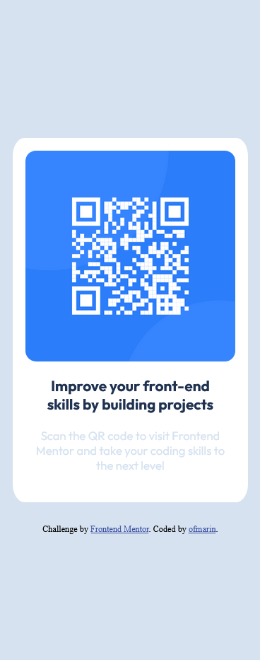

# Frontend Mentor - QR code component solution

This is a solution to the [QR code component challenge on Frontend Mentor](https://www.frontendmentor.io/challenges/qr-code-component-iux_sIO_H). Frontend Mentor challenges help you improve your coding skills by building realistic projects.

## Table of contents

- [Overview](#overview)
  - [Screenshot](#screenshot)
  - [Links](#links)
- [My process](#my-process)
  - [Built with](#built-with)
  - [What I learned](#what-i-learned)
  - [Continued development](#continued-development)
  - [Useful resources](#useful-resources)
  - [AI Collaboration](#ai-collaboration)
- [Author](#author)
- [Acknowledgments](#acknowledgments)

## Overview

### Screenshot

### Links

- Solution URL: [Repository](https://github.com/ofmarin/qr-code-component)
- Live Site URL: [Live site](https://ofmarin.github.io/qr-code-component/)

## My process

### Built with

- Semantic HTML5 markup
- Flexbox
- Mobile-first workflow
- [Angular v21+](https://angular.dev/) - TS Framework

### What I learned

 Remembered the basics of css, flex, how to fit content to the containers, how to add fonts (hopefully I did it correctly)

### Continued development

I basically want to use frontend mentor challenges to build my knowledge of angular
from the ground up. Maybe add SCSS and other tools I find the road to improve.

### Useful resources

- [Angular](https://Angular.dev) - Checking the documentation.

### AI Collaboration

- I use Gemini to bounce ideas and to help me with things I would normally google
- It helped me remember the CSS code I forgot.
- overall I use it as a discussion tools and learning tool.
- It's best when we bounce ideas rather than just take its answers.

## Author

- Frontend Mentor - [@ofmarin](https://www.frontendmentor.io/profile/ofmarin)

